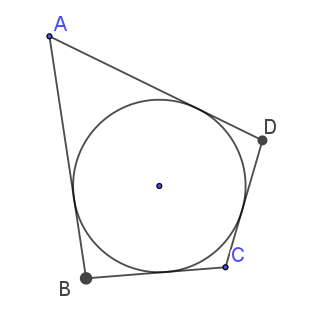
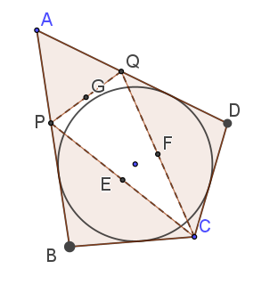

This program will construct a Tangential Quadrilateral.  That is, a four sided polygon that can contain an inscribed circle which is tangent to all four sides.  The simplest such figure to think about is a square with a tangent circle inside.
Pitot's theorem asserts that in a tangential quadrilateral the two pairs of opposite sides have the same total length.

Note that for any point outside of the circle, since tangents go from the point to the circle, each of the two segments from an external point to the nearest tangent are of equal length. This "equal segments from an external point" is easy enough to prove using triangles.

Looking at point B, which is general for all four corners, we see that two congruent triangles exist, both with one side of length "circle radius", both with a common hypotenuse, and both with a right angle.  Consequently, lengths BM and BG are the same.

To go from there to the proof of Pitot's theorem is merely a matter of labelling these little segments and then considering the result.

$\mathbf{Pitot's Theorem:}$ When a circle is inscribed inside of a quadrilateral such that it is tangent to all four sides, then the sum of opposite sides is equal.

Proof:

Since a+b+c+d are the sum of the two opposite sides, no matter which two opposite sides we select, then the theorem is proved. 
$\blacksquare$

$\mathbf{Converse of Pitot:}$ Any quadrilateral whose opposite sides sum to be the same amount, can have a circle tangent to all four sides inscribed within it.

Proof:
We are given a quadrilateral whose opposite sides sum the same.
$$AB + CD = BC + AD \tag{eq 1}$$

If the figure is a square, then the converse theorem is true since the distance from circle center to midpoint of each side is the same and a circle is incribable.

But suppose $AB\ne CD$ and $BC \ne AD.$ EQ 1 still holds, so
$$AB-BC = AD - CD \tag{eq 2}$$
is true by algebra. Further, by switching the segments about, one can always arrange positive values.

Now we will construct two new point, P and Q,
The point P on segment AB is such that 
$$BP = BC$$ 
and similarly Q on segment AD such that 
$$DQ = CD$$

Connecting these points as shown in the figure creates 3 isosceles trianges whose midpoints, E,F,G together with the circle center bisect angles B, D, and A respectively. Consequently, the circle center is equidistance from segments 
$$AB, BC, CD, \text{ and }AD.\tag*{$\blacksquare$}$$

