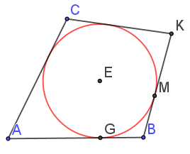
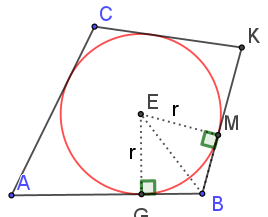
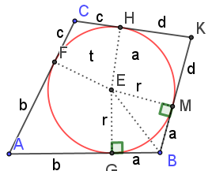

This program will construct a Tangential Quadrilateral.  That is, a four sided polygon that can contain an inscribed circle which is tangent to all four sides.  The simplest such figure to think about is a square with a tangent circle inside.
Pitot's theorem asserts that in a tangential quadrilateral the two pairs of opposite sides have the same total length.

Note that for any point outside of the circle, since tangents go from the point to the circle, each of the two segments from an external point to the nearest tangent are of equal length. This "equal segments from an external point" is easy enough to prove using triangles.

Looking at point B, which is general for all four corners, we see that two congruent triangles exist, both with one side of length "circle radius", both with a common hypotenuse, and both with a right angle.  Consequently, lengths BM and BG are the same.

To go from there to the proof of Pitot's theorem is merely a matter of labelling these little segments and then considering the result.

So we want to confirm that side AC + BK = CK + AB. Doing so proves Pitot's theorem.
Replace AC + BK with its segment names.
$$AC + BK = b+c+a+d$$
Do the same with CK + AB.
$$CK + AB = c+d+b+a$$
Clearly, the sides 
$$AC+BK = a+b+c+d = CK + AB \tag*{$\blacksquare$}